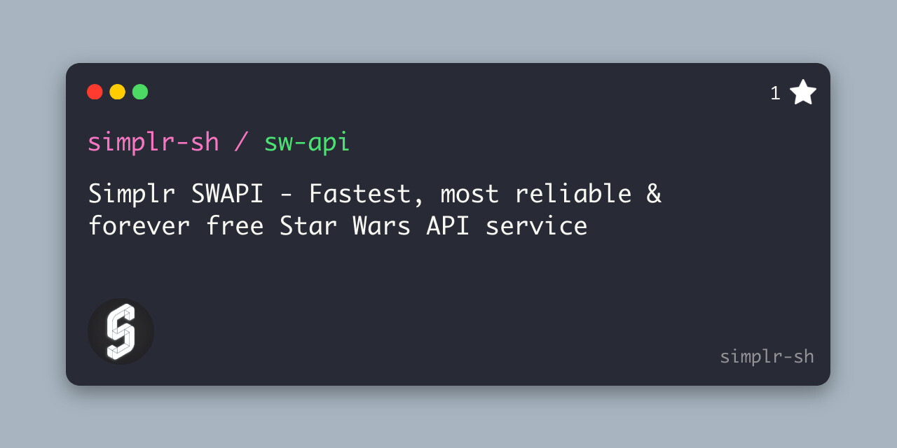

<div align="center">
    
    <h1 align="center">
      <a href="https://github.com/simplr-sh/sw-api">
        Simplr SWAPI
      </a>
    </span>
</div>

### The fastest, most reliable, and forever free Star Wars API service.




## Features

- 🚀 Lightning fast responses
- 💪 High reliability and uptime
- 🆓 Forever free to use
- 📦 Complete Star Wars data
- 🔒 No authentication required
- 📄 Well-documented endpoints

## Technology

This API is powered by Cloudflare Workers, providing:
- 🌍 Global CDN with edge computing
- ⚡ Ultra-low latency responses
- 🔄 Automatic failover and high availability
- 🛡️ Enterprise-grade DDoS protection
- 🌐 Data centers in 200+ cities worldwide


## Project Structure
```
├── public/ # Static JSON data files
│ └── api/ # API endpoints data
│     ├── films/
│     ├── people/
│     ├── planets/
│     ├── species/
│     ├── starships/
│     ├── vehicles/
│
└── root.json
├── src/
│   └── index.ts # Main entry point
├── wrangler.toml
└── package.json
```

## Data Categories

- People
- Films
- Species
- Planets
- Vehicles
- Starships

## Getting Started

### Installation

```bash
npm install
npm run dev
```

### Deployment

```bash
npm run deploy
```

## API Usage

### Base URL
```
https://sw.simplr.sh
```

### Root Endpoint
```
GET /api/root.json
```

### Endpoints

#### People
```
# Get all people
GET /api/people/all.json
# Example: https://sw.simplr.sh/api/people/all.json

# Get specific person
GET /api/people/{id}.json
# Example: https://sw.simplr.sh/api/people/1.json
```

#### Films
```
# Get all films
GET /api/films/all.json
# Example: https://sw.simplr.sh/api/films/all.json

# Get specific film
GET /api/films/{id}.json
# Example: https://sw.simplr.sh/api/films/1.json
```

#### Planets
```
# Get all planets
GET /api/planets/all.json
# Example: https://sw.simplr.sh/api/planets/all.json

# Get specific planet
GET /api/planets/{id}.json
# Example: https://sw.simplr.sh/api/planets/1.json
```

#### Species
```
# Get all species
GET /api/species/all.json
# Example: https://sw.simplr.sh/api/species/all.json

# Get specific species
GET /api/species/{id}.json
# Example: https://sw.simplr.sh/api/species/1.json
```

#### Starships
```
# Get all starships
GET /api/starships/all.json
# Example: https://sw.simplr.sh/api/starships/all.json

# Get specific starship
GET /api/starships/{id}.json
# Example: https://sw.simplr.sh/api/starships/3.json
```

#### Vehicles
```
# Get all vehicles
GET /api/vehicles/all.json
# Example: https://sw.simplr.sh/api/vehicles/all.json

# Get specific vehicle
GET /api/vehicles/{id}.json
# Example: https://sw.simplr.sh/api/vehicles/4.json
```


## Technology Stack

- Cloudflare Workers
- Hono.js framework
- TypeScript
- JSON static assets

## Contributing

1. Fork the repository
2. Create your feature branch (`git checkout -b feature/amazing-feature`)
3. Commit your changes (`git commit -m 'Add some amazing feature'`)
4. Push to the branch (`git push origin feature/amazing-feature`)
5. Open a Pull Request

## License

MIT License - feel free to use this project for any purpose.

## Acknowledgments

- Data based on the Star Wars universe
- Powered by Cloudflare Workers
- Built with Hono.js
